# TL866 FlashROM Programming Adapter

[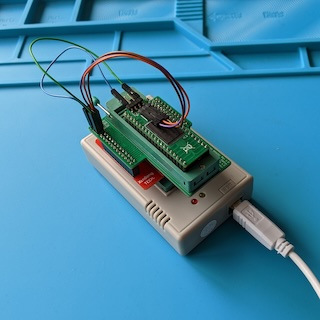](images/Adapter.jpg?raw=1)

This repository contains the KiCad project and Gerber files for a TL866
Programming Adapter for 29F400/29F800/29F160 Flash ROMs which are used to
replace 29C400/29C800/29C160 EPROMs in retro machines like the Amiga.

> [!IMPORTANT]
> Besides this adapter, you also need the SN001-1 TSOP48 adapter which came with your
> TL866 or which is sold separately!

> [!WARNING]
> I use this adapter with my TL866 II plus. I do not know if it works with the
> older TL866 A or CS, but it probably does. It does __not__ work with the newer
> Xgecu T48 aka TL866-3G or the Xgecu T56 programmers!

## Ordering the PCB

The subdirectory "gerber-files" contains a Zip file you can use to order the PCB
from PCB manufacturers like PCBWay or JLCPCB. Simply upload the Zip on their web
page.

## Building the Adapter

### Bill of Materials

* __1x ZIF Socket 48 Pins 2.54mm pitch__

  This is where you put the Flash ROM into.

* __2x 2x12 Female Pin Sockets Through Hole Straight Angle 2.54mm pitch__

  Used to connect this adapter to the SN-001-01 adapter.

* __1x 2x3 Male Pin Header Through Hole Straight Angle 2.54mm pitch__

  There are some signals on this pin header that you need to connect to your
  Flash ROM.

* __Dupont Jumper cables depending on your type of Flash ROM__

  These are used to connect the signals on the pin header to your Flash ROM.
  This depends on your type of Flash ROM. For my Flash ROM, five short
  female-to-female jumper cables are needed.

### Soldering the ZIF Socket

Insert the ZIF socket into the PCB. This can be a little bit fiddly, because the
quality of the cheap ZIF sockets from Aliexpress is quite low, the pins are
usually bend and the holes in the PCB are small. You might have to use pliers to
bend the pins in shape, but do not bend to much, otherwise the parts on the top
side of the ZIF socket might start moving and get out of alignment. Solder the
socket from the bottom side.

[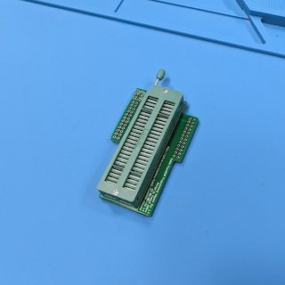](images/Solder_ZIF_Socket_top.jpg?raw=1)
[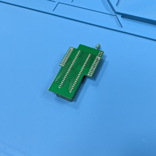](images/Solder_ZIF_Socket_bottom.jpg?raw=1)

### Soldering the Connection to the SN001-1 Adapter

Next, solder the two 2x12 pin headers to the underside of the PCB which connect
the PCB to the SN001-1 adapter. It is crucial that these pin headers are
correctly aligned, otherwise they might not fit onto the adapter. I recommend to
stick the SN001-1 adapter into a breadboard, stick the 2x12 pin headers onto
the adapter, and finally put the PCB on the pin headers. Doing so ensures
correct alignment, but you have to be careful not to drop solder onto the
SN001-1 adapter or the breadboard.

[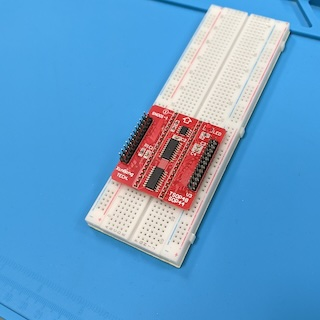](images/Adapter_on_Breadboard.jpg?raw=1)
[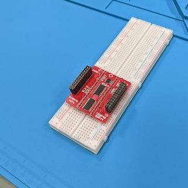](images/Adapter_on_Breadboard_with_Pin_Headers.jpg?raw=1)
[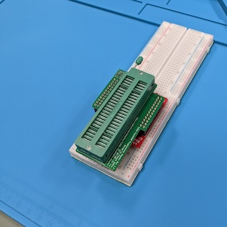](images/Solder_the_Connection.jpg?raw=1)

### Soldering the 2x3 Pin Headers

Finally, solder the 2x3 pin headers onto the PCB. This is a simple and
straightforward task.

[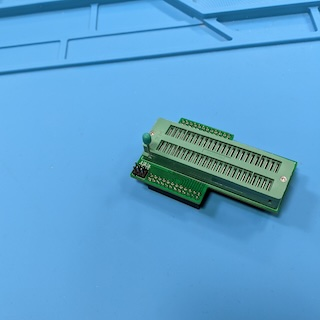](images/Solder_the_2x3_Pin_Header.jpg?raw=1)

## Using the Adapter

First, put the adapter on top of the SN001-1 adapter. Then, put both adapters
into the TL866 ZIF socket. Put your Flash ROM into the ZIF socket of
the adapter. __Your Flash ROM needs to be aligned to the bottom of the ZIF
socket!!!__.

[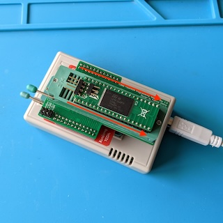](images/Alignment.jpg?raw=1)

The final step is to connect a few signals which are available on the 2x3 pin
header on the top left of the PCB to your Flash ROM by using Dupont jumper wires
like the ones used for breadboards. This depends a little bit on the type of
Flash ROM you are using.

[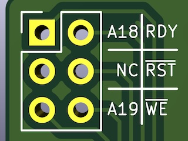](images/Pin_Assignment.jpg?raw=1)

On the right side of the 2x3 pin header are the signals RDY ("Ready",
sometimes also called /BSY or "Busy"), /RST ("Reset"), and /WE ("Write Enable").
These are needed on all types of Flash ROMs. Locate these signals on your Flash
ROM, and connect them to the pin header using jumper wires.

On the left side of the 2x3 pin header are the address lines A18 and A19.
Connecting these depends on the type of Flash ROM you have. Usually, these are
the pins where you connect a switch to be able to select between different
ROMs.

When you're using a 40 pin Flash ROM for 16 bit machines like the Amiga 500,
you have to connect the address lines like this:

* When you have a 29F400 flash, you do not need to connect the address lines
  at all.

* When you have a 29F800 flash, you have to connect the address line A18.
  Locate that signal on your Flash ROM, and connect it to the pin header using
  a jumper wire.

* When you have a 29F160 flash, you have to connect both address lines A18 and
  A19. Locate these signals on your Flash ROM, and connect them to the pin
  header using jumper wires.

When you're using a 42 pin Flash ROM for 32 bit machines like the Amiga 1200,
you do not need to connect these address lines at all. They are already
connected by the top two pins in the ZIF socket.

The image below shows my 40 pin Flash ROM designed by Matthias Münch with a
29F160 flash with all jumper cables attached. Your Flash ROM might look a little
bit different.

[](images/Adapter.jpg?raw=1)

When everything is set up correctly, you can connect the TL866 to the USB port
of your computer and start programming the flash.

I do have a 29F160 Flash ROM for my Amiga 500, which has a capacity of 2
megabytes or 4 slots of 512 kilobytes for different Kickstart ROMs. I wanted to
have the original Kickstart 1.3 in the first slot, Kickstart 3.1 in the second
slot, the [Diagnostic ROM](https://www.diagrom.com/) in the third slot, and the
fourth slot unused.

To program the flash, you can use the original "Xgpro" software which came with
the TL866 on Windows, or the
[opensource software "minipro"](https://gitlab.com/DavidGriffith/minipro) on
MacOS or Linux. In the following two sections, I will explain both ways to
program the Flash ROM.

### Using the original "Xgpro" software on Windows

After starting the "Xgpro" software, you first have to select the correct
Flash chip that is soldered on your Flash ROM. On my Flash ROM, it is a
M29F160FB, but on your Flash ROM it might be a different flash chip. Have a
look at what is written on your flash chip.

[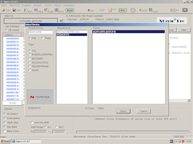](images/Xgpro_Select_Device.png?raw=1)

After selecting the correct flash chip, we have to fill the data buffer with the
data we want to write onto the flash. The data buffer by default is shown in the
program window as 16 bit words filled with hexadecimal $FFFF, and the addresses
shown on the left side are word addresses. Because this can be confusing, I
recommend to switch the buffer view to "8 Bits".

In the first slot (addresses $000000-$07FFFF) we want to write the Kickstart
1.3 ROM. But there is one little problem: Each slot has 512 kilobytes, but the
Kickstart 1.3 ROM is only 256 kilobytes. What you have to do is to copy the
Kickstart 1.3 ROM __twice__ into the final ROM file. So in the Xgpro Software,
click on "LOAD". In the "File load Options" dialog, click on "Browse"
and select the Kickstart 1.3 ROM file. "File Format" must be "BINARY". The
"Load mode" must be "Normal", "From File Start Addr(Hex)" must be "00000", and
"TO Buffer Strat Addr(HEX)" must be "00000". "Clear Buffer when loading the
file" must be set to "Disable". After clicking "OK", the buffer gets filled with
Kickstart 1.3 from addresses $000000-$3FFFF. Now, click on "LOAD" again, and
this time load the Kickstart 1.3 ROM file to buffer start address "40000". All
other settings stay the same. Do not forget to disable "Clear Buffer"!

[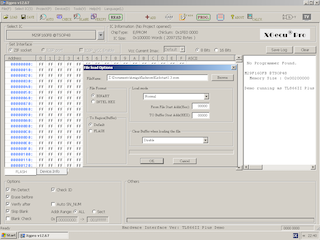](images/Xgpro_Load_Kick13_000000.png?raw=1)
[](images/Xgpro_Load_Kick13_040000.png?raw=1)

In the second slot (addresses $080000-$0fffff) we want to write the Kickstart
3.1 ROM. So click on "LOAD" again and click on "Browse" to select the Kickstart
3.1 ROM file. Set the buffer start address to "80000", and set all other options
as for the 1.3 ROM. Again, do not forget to disable "Clear Buffer"!

[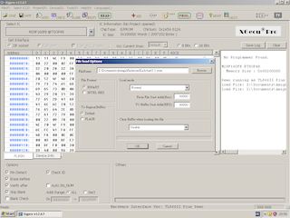](images/Xgpro_Load_Kick31_080000.png?raw=1)

In the third slot (addresses $100000-$17ffff) we want to write the diagnostic
ROM. So click on "LOAD" and on "Browse" to select the diagnostic ROM file. Set
the buffer start address to "100000", and set all other options as for the
previous ROMs. Do not forget to disable "Clear Buffer"!

[](images/Xgpro_Load_Diag_100000.png?raw=1)

Now we are almost finished, but there is one more important step to do: We have
to swap the bytes of the two Kickstart ROMs because the Motorola 68000 is a big
endian machine, and the machine used for burning the flash is a little endian
machine. The diagnostic ROM already is byte swapped! Click on the menu entry
"File(F)/Fill Block/Swap(F)". In the "Fill block" dialog, make sure
"Stard_Addr: 0x" is set to "00000000", and set "End_Addr: 0x" to "000fffff".
Under "Swap Byte or Word", select "16Bits" and click on the "Swap" button.

[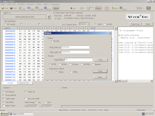](images/Xgpro_Swap.png?raw=1)

Now we are finally ready to program the flash chip!

### Using the opensource software "minipro" on MacOS and Linux

First of all, you have to byte swap the Kickstart ROMs, because the Motorola
68000 is a big endian machine, and the machine used for burning the flash is a
little endian machine. To do that, we can use the "dd" command like this:

```
dd if=Kickstart1.3.rom of=Kickstart1.3.swapped.rom conv=swab
dd if=Kickstart3.1.rom of=Kickstart3.1.swapped.rom conv=swab
```

The diagnostic ROM already is byte swapped, so we can use it directly. Now we
have to combine the ROMs into one single file. But there is one little problem:
Each slot has 512 kilobytes, but the Kickstart 1.3 ROM is only 256 kilobytes.
What you have to do is to copy the Kickstart 1.3 ROM __twice__ into the final
ROM file. To create the final combined file, I use the "cat" command like this:

```
cat Kickstart1.3.swapped.rom Kickstart1.3.swapped.rom Kickstart3.1.swapped.rom 16bit.bin >combined.rom
```

This file is 512 kilobytes too small, but that does not matter.

Finally, I use the "minipro" command to burn the ROM file to the flash:

```
minipro -p "M29F160FB@TSOP48" -s -w combined.rom
```

The "-p" option specifies the type of flash that if soldered on your Flash ROM.
On my Flash ROM, it is a M29F160FB, but on your Flash ROM it might be a
different flash chip. Have a look at what is written on your flash chip, and
adjust the "-p" option accordingly. The "-s" option tells the minipro command
that our file does not fill the complete flash, and the "-w" option tells the
minipro command to write the file "combined.rom" to the flash.

## License

TL866 FlashROM Programming Adapter (c) by Patrick Dähne

TL866 FlashROM Programming Adapter is licensed under a
Creative Commons Attribution-NonCommercial-ShareAlike 4.0 International License.

You should have received a copy of the license along with this
work. If not, see <https://creativecommons.org/licenses/by-nc-sa/4.0/>.
